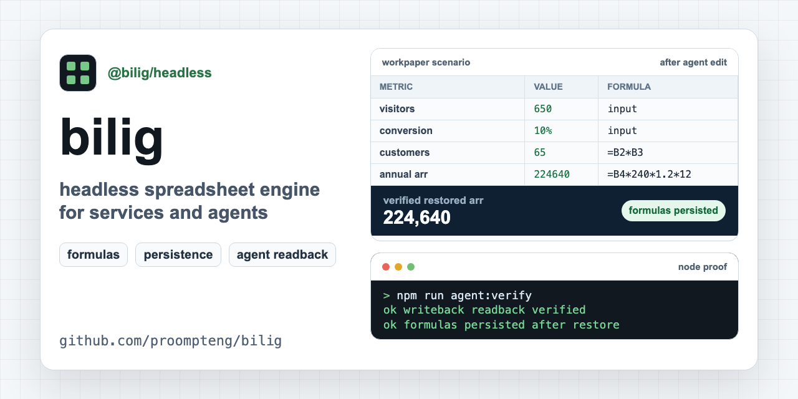

# bilig

[](https://github.com/proompteng/bilig/actions/workflows/ci.yml)
[](https://www.npmjs.com/package/@bilig/xlsx-formula-recalc)
[](https://www.npmjs.com/package/@bilig/headless)
[](https://www.npmjs.com/package/@bilig/workpaper)
[](https://github.com/proompteng/bilig/actions/workflows/codeql.yml)
[](https://scorecard.dev/viewer/?uri=github.com/proompteng/bilig)
[](LICENSE)

**Catch stale XLSX formulas before Node or CI reads the wrong number.**

Bilig is for workbook logic that has to run from code. If an existing `.xlsx`
file is the contract, use the cache doctor to find stale cached formula values.
If your service or agent should own the workbook model, use WorkPaper/headless
to edit cells, recalculate formulas, read outputs, and persist JSON.

Start with the boundary you actually have. Do not drive Excel, LibreOffice,
Google Sheets, or a screenshot UI just to learn whether a formula value is
fresh.

Run the no-clone checks:

```sh
npm exec --yes --package @bilig/xlsx-formula-recalc@latest -- bilig-evaluate --door xlsx-cache --json
npm exec --yes --package @bilig/workpaper@latest -- bilig-evaluate --door workpaper-service --json
npm exec --yes --package @bilig/workpaper@latest -- bilig-evaluate --door agent-mcp --json
```

Expected XLSX cache result:

```json
{
  "schemaVersion": "bilig-evaluator.v1",
  "door": "xlsx-cache",
  "verified": true,
  "evidence": {
    "target": "Summary!B2",
    "before": 60000,
    "after": 72000,
    "staleCachedFormulaCount": 1,
    "suggestedReads": ["Summary!B2"]
  }
}
```

Need the full formula-cache report for a real workbook?

```sh
npm exec --package @bilig/xlsx-formula-recalc@latest -- xlsx-cache-doctor pricing.xlsx --json
npm exec --package @bilig/xlsx-formula-recalc@latest -- xlsx-recalc pricing.xlsx --read Summary!B2 --out pricing.recalculated.xlsx --json
```

For pull requests with XLSX fixtures, start with the GitHub Action in report
mode and let it show stale cached formulas before it blocks anything:

```yaml
- uses: actions/setup-node@v6
  with:
    node-version: '22'
    package-manager-cache: false
- uses: proompteng/bilig@v1
  with:
    workbooks: '**/*.xlsx'
    changed-files-only: 'true'
    package-version: '0.147.0'
    fail-on-stale: 'false'
```

For TypeScript services that should own the workbook model:

```sh
npm create @bilig/workpaper@latest pricing-agent -- --agent
cd pricing-agent
npm install
npm run agent:verify
```

For lower-level runtime imports:

```sh
npm install @bilig/headless
```

Direct diagnostic commands remain available:

```sh
npm exec --yes --package @bilig/workpaper@latest -- bilig-agent-challenge --json
npm exec --yes --package @bilig/workpaper@latest -- bilig-mcp-challenge --json
```

Evaluator examples live in
[`examples/bilig-evaluator-proof`](examples/bilig-evaluator-proof).

Project site: <https://proompteng.github.io/bilig/>

## Start Here

Pick the path that matches the job:

| You have...                                                             | Start with                                                                 | You should see                                                                            |
| ----------------------------------------------------------------------- | -------------------------------------------------------------------------- | ----------------------------------------------------------------------------------------- |
| A real `.xlsx` file has stale formula results after Node edits          | [XLSX Cache Doctor evaluator](docs/eval-xlsx-cache-doctor.md)              | stale cells, cached values, recalculated values, suggested reads, and JSON output.        |
| Pull requests can commit XLSX fixtures with stale cached values         | [XLSX Cache Doctor GitHub Action](docs/xlsx-cache-doctor-github-action.md) | report-only workbook findings before the workflow blocks anything.                        |
| A Node service, route, queue, test, or tool needs workbook logic        | [Node service WorkPaper evaluator](docs/eval-workpaper-service.md)         | input edit, recalculated output, serialized JSON, restore check, and `verified: true`.    |
| A coding agent or MCP client needs workbook tools without UI automation | [Agent MCP evaluator](docs/eval-agent-mcp.md)                              | tool discovery, cell edit, formula readback, export, restart check, and `verified: true`. |
| Existing XLSX outputs need refreshed cached results                     | [XLSX recalculation evaluator](docs/eval-xlsx-recalc.md)                   | changed input, recalculated output, output workbook, and `recalculationCompleted: true`.  |

If you are not sure which one fits, start with the thing that owns state. Use
WorkPaper when your service or agent should own the workbook model. Use the XLSX
path when a saved Excel file is still the source of truth.

The shortest no-project checks are:

```sh
npm exec --yes --package @bilig/xlsx-formula-recalc@latest -- bilig-evaluate --door xlsx-cache --json
npm exec --yes --package @bilig/workpaper@latest -- bilig-evaluate --door workpaper-service --json
npm exec --yes --package @bilig/workpaper@latest -- bilig-evaluate --door agent-mcp --json
npm exec --package @bilig/xlsx-formula-recalc@latest -- xlsx-recalc --demo --json
```

Good fits: pricing, quote approval, payout checks, import validation, forecasts,
CI fixtures, formula-backed workflow steps, and coding agents that need exact
cell addresses plus readback. Bad fits: manual spreadsheet editing, Office
macros, desktop Excel automation, or one-off arithmetic where a workbook would
be ceremony.

The canonical XLSX guide is
[Fix stale XLSX formula values in Node.js](docs/stale-xlsx-formula-cache-node.md).
If you are answering a public SheetJS, ExcelJS, `xlsx-populate`, template, or CI
question, use the non-spam
[XLSX formula support answers](docs/xlsx-formula-support-answers.md) first.
For a direct before/after proof across SheetJS, `xlsx-populate`, and ExcelJS:

```sh
npm --prefix examples/recalc-bridge-workflows install
npm --prefix examples/recalc-bridge-workflows run smoke
```

For the GitHub Action listing and a live reviewer path:

- <https://github.com/marketplace/actions/xlsx-cache-doctor>
- <https://github.com/proompteng/xlsx-cache-doctor-demo/pull/1>

## If You Only Try One Thing

Catch a stale cached formula value first. It is the shortest proof that Bilig is
doing something ExcelJS, SheetJS, and `xlsx-populate` do not do inside Node:
recalculate the workbook and show the value your code would otherwise trust.

```sh
npm exec --yes --package @bilig/xlsx-formula-recalc@latest -- bilig-evaluate --door xlsx-cache --json
```

Expected shape:

```json
{
  "schemaVersion": "bilig-evaluator.v1",
  "door": "xlsx-cache",
  "verified": true,
  "evidence": {
    "target": "Summary!B2",
    "before": 60000,
    "after": 72000,
    "staleCachedFormulaCount": 1,
    "suggestedReads": ["Summary!B2"]
  }
}
```

If your service should own the workbook model instead of passing XLSX files
around, run the WorkPaper door:

```sh
npm exec --yes --package @bilig/workpaper@latest -- bilig-evaluate --door workpaper-service --json
```

If an agent or MCP client owns the workflow, run the agent door:

```sh
npm exec --yes --package @bilig/workpaper@latest -- bilig-evaluate --door agent-mcp --json
```

Trust boundaries:

- Runs locally in Node or in your GitHub Actions runner; no hosted workbook
  upload is required.
- Does not claim Excel parity. Start with
  [where Bilig is not Excel-compatible yet](docs/where-bilig-is-not-excel-compatible-yet.md)
  before using it for irreversible workflows.
- The XLSX cache doctor is diagnostic by default. It only blocks pull requests
  when you opt into `fail-on-stale`.

For linked workbooks, use the
[external workbook recalculation proof](docs/external-workbook-recalc-proof.md).
For stale cached XLSX values, use
[Evaluate stale XLSX formula caches](docs/eval-xlsx-cache-doctor.md).
For a narrower recalculation evaluator, use
[Evaluate XLSX formula recalculation](docs/eval-xlsx-recalc.md).

If you already have the real workbook but do not know which formulas to read
yet, inspect it first without writing an output file:

```sh
npm exec --package @bilig/xlsx-formula-recalc@latest -- xlsx-cache-doctor pricing.xlsx --json
```

That checks every formula by default, reports any skipped formulas as
`uninspectedFormulaCellCount`, returns stale cached values, and suggests
`--read` targets so the next command can prove the cells your service actually
depends on.

If your service or test runner needs the same report without a subprocess, use
the Node API:

```ts
import { readFile } from 'node:fs/promises'
import { inspectXlsxCache } from '@bilig/xlsx-formula-recalc'

const report = inspectXlsxCache(await readFile('pricing.xlsx'), {
  fileName: 'pricing.xlsx',
})

if (report.staleCachedFormulaCount > 0) {
  throw new Error(
    report.formulas
      .filter((formula) => formula.cacheStatus === 'stale')
      .map((formula) => formula.target)
      .join(', '),
  )
}
```

To run that check in CI, install
[XLSX Cache Doctor from GitHub Marketplace](https://github.com/marketplace/actions/xlsx-cache-doctor),
read the [GitHub Action guide](docs/xlsx-cache-doctor-github-action.md), or
copy the runnable example at
[`examples/xlsx-cache-doctor-ci`](examples/xlsx-cache-doctor-ci).
For a live reviewer path, inspect the
[demo pull request](https://github.com/proompteng/xlsx-cache-doctor-demo/pull/1):
it runs `proompteng/bilig@v1`, proves 60 formula cells were inspected, finds 1
stale cached formula value, and uploads the JSON report.

To generate the pull-request workflow instead of hand-writing YAML:

```sh
mkdir -p .github/workflows
npm exec --package @bilig/xlsx-formula-recalc@latest -- \
  xlsx-cache-doctor --print-github-action "**/*.xlsx" \
  > .github/workflows/xlsx-cache-doctor.yml
```

The generated workflow is read-only and report-only by default. Add
`--fail-on-stale true` when you want stale cached values to block pull requests,
or pass `--inspect-limit`, `--json-output`, or `--markdown-output` to match your
CI artifact policy. The Action uploads machine-readable JSON and a
human-readable Markdown report path, so reviewers can inspect the stale cells
without giving the detector write permissions.

If your pipeline is specifically SheetJS / `xlsx`, run the sibling proof with
the same shape:

```sh
npm exec --package @bilig/sheetjs-formula-recalc@latest -- sheetjs-recalc --demo --json
```

If the workbook is already in ExcelJS, keep that boundary and add
`@bilig/exceljs-formula-recalc`:

```sh
npm install exceljs @bilig/exceljs-formula-recalc
npm exec --package @bilig/exceljs-formula-recalc@latest -- exceljs-recalc --demo --json
```

For one checkout proof across SheetJS/`xlsx`, `xlsx-populate`, and ExcelJS:

```sh
npm --prefix examples/recalc-bridge-workflows install
npm --prefix examples/recalc-bridge-workflows run smoke
```

That bridge proof is the fastest way to check whether Bilig solves the stale
formula-value problem without asking you to adopt WorkPaper state first.

## Which Path Should I Install?

| Problem you have right now                                                        | Install or use                           | First proof                                                                      |
| --------------------------------------------------------------------------------- | ---------------------------------------- | -------------------------------------------------------------------------------- |
| Pull requests can commit XLSX fixtures with stale formula caches                  | `uses: proompteng/bilig@v1`              | [XLSX Cache Doctor GitHub Action](docs/xlsx-cache-doctor-github-action.md)       |
| Generic XLSX bytes changed in Node; formula outputs must refresh before returning | `npm install @bilig/xlsx-formula-recalc` | [XLSX formula recalculation in Node.js](docs/xlsx-formula-recalculation-node.md) |
| Formula workbook state belongs inside a Node service, route, queue, test, or tool | `npm install @bilig/workpaper`           | [Node service WorkPaper evaluator](docs/eval-workpaper-service.md)               |

Advanced adapters are still available when the boundary is already specific:
[SheetJS](docs/sheetjs-formula-result-not-updating-node.md),
[ExcelJS](docs/exceljs-formula-recalculation-node.md),
[external workbooks](docs/external-workbook-recalc-proof.md),
[agent tools](docs/ai-agent-spreadsheet-tool-node.md),
[`@bilig/workbook`](docs/workbook-agent-intent-api.md) when a runtime needs
transport-neutral plan data and command receipts, and
[runtime provenance](docs/npm-provenance-package-trust.md).

## Agent And WorkPaper Proof

For agent adoption, use the
[Agent Adoption Kit](docs/agent-adoption-kit.md): install the skill, run the
no-key agent MCP evaluator, paste one workbook task into the agent, and require
`verified: true` before trusting the result.

Coding agent? Do not start by driving Excel, LibreOffice, Google Sheets, or a
browser grid. Use the headless WorkPaper proof instead:
`npm exec --yes --package @bilig/workpaper@latest -- bilig-evaluate --door agent-mcp --json`.
Then follow the [agent MCP evaluator](docs/eval-agent-mcp.md).

The published package also carries `AGENTS.md` and `SKILL.md` so coding agents
inspecting `node_modules/@bilig/workpaper` can find the write/read/persist loop
locally. Cloned checkouts expose the same workflow through
`.claude/skills/bilig-workpaper/SKILL.md`,
`.claude/commands/bilig-workpaper-proof.md`,
`.cursor/rules/bilig-workpaper.mdc`, `.windsurf/rules/bilig-workpaper.md`,
`.clinerules/bilig-workpaper.md`, and `.continue/rules/bilig-workpaper.md`.
The public docs expose the same agent path through
[`docs/.well-known/agent.json`](docs/.well-known/agent.json).

```sh
npx --yes skills@latest add https://bilig.proompteng.ai --list
npx --yes skills@latest add proompteng/bilig --skill bilig-workpaper --list
npm exec --yes --package @bilig/workpaper@latest -- bilig-evaluate --door agent-mcp --json
```

## Integration Recipes After The Proof

Run one core proof above before wiring a platform-specific integration. These
recipes are for teams that already know where the workbook tool needs to live.

| Host or workflow runner                                    | Use Bilig when...                                                                                                                                                               | Guide                                                                                                                                                                                                                                                                                                                                                                                     |
| ---------------------------------------------------------- | ------------------------------------------------------------------------------------------------------------------------------------------------------------------------------- | ----------------------------------------------------------------------------------------------------------------------------------------------------------------------------------------------------------------------------------------------------------------------------------------------------------------------------------------------------------------------------------------- |
| Open WebUI                                                 | A local or hosted tool server should expose workbook reads, writes, and formula readback.                                                                                       | [Open WebUI WorkPaper tool setup](https://proompteng.github.io/bilig/open-webui-workpaper-mcp.html)                                                                                                                                                                                                                                                                                       |
| LobeHub                                                    | A LobeHub agent needs a Custom MCP server for workbook tools.                                                                                                                   | [LobeHub WorkPaper MCP setup](https://proompteng.github.io/bilig/lobehub-workpaper-mcp.html)                                                                                                                                                                                                                                                                                              |
| AnythingLLM                                                | Agent Skills should call hosted MCP or a private file-backed stdio server.                                                                                                      | [AnythingLLM WorkPaper MCP setup](https://proompteng.github.io/bilig/anythingllm-workpaper-mcp.html)                                                                                                                                                                                                                                                                                      |
| Sim                                                        | An Agent block or MCP Tool block should read, write, recalculate, and export proof.                                                                                             | [Sim WorkPaper MCP setup](https://proompteng.github.io/bilig/sim-workpaper-mcp.html)                                                                                                                                                                                                                                                                                                      |
| FastMCP Python                                             | A Python client should smoke-test hosted MCP or launch a private file-backed stdio WorkPaper.                                                                                   | [FastMCP WorkPaper client](https://proompteng.github.io/bilig/fastmcp-workpaper-client.html)                                                                                                                                                                                                                                                                                              |
| Hugging Face smolagents                                    | A `Tool` should return structured formula readback proof to a `CodeAgent`.                                                                                                      | [smolagents WorkPaper tool](https://proompteng.github.io/bilig/smolagents-workpaper-tool.html)                                                                                                                                                                                                                                                                                            |
| Hugging Face Gradio MCP Space                              | A Space template should expose one no-key WorkPaper readback tool before a team wires private workbook state.                                                                   | [Hugging Face Gradio MCP Space](https://proompteng.github.io/bilig/huggingface-workpaper-space.html)                                                                                                                                                                                                                                                                                      |
| n8n, Dify, Flowise, Pipedream                              | Workflow builders need formula readback without spreadsheet UI automation; use `@bilig/n8n-nodes-workpaper`, the upstream merged Dify plugin, or the reviewed Pipedream action. | [n8n](https://proompteng.github.io/bilig/n8n-workpaper-formula-readback.html), [Dify](https://proompteng.github.io/bilig/dify-workpaper-formula-readback.html), [Flowise](https://proompteng.github.io/bilig/flowise-workpaper-formula-readback.html), [Pipedream](https://proompteng.github.io/bilig/pipedream-workpaper-formula-readback.html)                                          |
| Vercel AI SDK                                              | `generateText()` or `streamText()` tools need before/after/restore proof.                                                                                                       | [Vercel AI SDK WorkPaper tools](https://proompteng.github.io/bilig/vercel-ai-sdk-langchain-spreadsheet-tool.html)                                                                                                                                                                                                                                                                         |
| LangGraph.js / LangChain MCP                               | ToolNode state should carry WorkPaper proof, or MCP adapters should discover workbook tools.                                                                                    | [LangGraph](https://proompteng.github.io/bilig/langgraph-workpaper-toolnode-spreadsheet.html), [LangChain MCP example](https://github.com/proompteng/bilig/tree/main/examples/langchain-mcp-workpaper-toolnode)                                                                                                                                                                           |
| Windmill, Trigger.dev Durable Formula Tasks, Inngest       | Durable workflow code should calculate fields from reviewable formulas.                                                                                                         | [Windmill](https://proompteng.github.io/bilig/windmill-workpaper-script.html), [Trigger.dev](https://proompteng.github.io/bilig/triggerdev-workpaper-task.html), [Inngest](https://proompteng.github.io/bilig/inngest-workpaper-step.html)                                                                                                                                                |
| Airbyte, Meltano                                           | Post-sync or post-ELT validation should return formula-backed record/state proof.                                                                                               | [Airbyte](https://proompteng.github.io/bilig/airbyte-workpaper-validation.html), [Meltano](https://proompteng.github.io/bilig/meltano-workpaper-utility.html)                                                                                                                                                                                                                             |
| Temporal, Airflow, Dagster Formula Assets, Kestra, Prefect | Orchestrators should own retries/history while a Node step owns workbook proof.                                                                                                 | [Temporal](https://proompteng.github.io/bilig/temporal-workpaper-activity.html), [Airflow](https://proompteng.github.io/bilig/airflow-workpaper-dag.html), [Dagster](https://proompteng.github.io/bilig/dagster-workpaper-asset.html), [Kestra](https://proompteng.github.io/bilig/kestra-workpaper-flow.html), [Prefect](https://proompteng.github.io/bilig/prefect-workpaper-flow.html) |
| Directus Persisted Calculated Fields                       | A custom operation should persist calculated fields with formula proof.                                                                                                         | [Directus WorkPaper Flow operation](https://proompteng.github.io/bilig/directus-workpaper-flow-operation.html)                                                                                                                                                                                                                                                                            |

<!-- Source recipe docs remain in docs/open-webui-workpaper-mcp.md, docs/lobehub-workpaper-mcp.md, docs/anythingllm-workpaper-mcp.md, docs/sim-workpaper-mcp.md, docs/fastmcp-workpaper-client.md, docs/smolagents-workpaper-tool.md, docs/huggingface-workpaper-space.md, docs/n8n-workpaper-formula-readback.md, docs/dify-workpaper-formula-readback.md, docs/flowise-workpaper-formula-readback.md, docs/pipedream-workpaper-formula-readback.md, docs/vercel-ai-sdk-langchain-spreadsheet-tool.md, docs/langgraph-workpaper-toolnode-spreadsheet.md, docs/windmill-workpaper-script.md, docs/triggerdev-workpaper-task.md, docs/inngest-workpaper-step.md, docs/airbyte-workpaper-validation.md, docs/meltano-workpaper-utility.md, docs/temporal-workpaper-activity.md, docs/airflow-workpaper-dag.md, docs/dagster-workpaper-asset.md, docs/kestra-workpaper-flow.md, docs/prefect-workpaper-flow.md, and docs/directus-workpaper-flow-operation.md. -->

## Choose An Evaluation Path

| If you are evaluating...      | Start here                                                                                                                                                                                                                                                                                | What should be true before you adopt                                                                        |
| ----------------------------- | ----------------------------------------------------------------------------------------------------------------------------------------------------------------------------------------------------------------------------------------------------------------------------------------- | ----------------------------------------------------------------------------------------------------------- |
| Existing XLSX files           | [XLSX recalculation evaluator](docs/eval-xlsx-recalc.md)                                                                                                                                                                                                                                  | A command edits inputs, reads recalculated values, writes XLSX, and returns `recalculationCompleted: true`. |
| Node service formulas         | [Node service WorkPaper evaluator](docs/eval-workpaper-service.md)                                                                                                                                                                                                                        | A starter writes one input, recalculates, persists JSON, restores, and prints `verified: true`.             |
| Agent MCP contract            | [Agent MCP workbook evaluator](docs/eval-agent-mcp.md)                                                                                                                                                                                                                                    | MCP tool discovery, input edit, formula readback, persistence, and restart proof all pass.                  |
| Agent intent/runtime adapters | [Workbook agent intent API](docs/workbook-agent-intent-api.md) and [workbook-agent-model example](https://github.com/proompteng/bilig/tree/main/examples/workbook-agent-model)                                                                                                            | A model prepares transport-neutral plan data, strict runtime proof, command receipts, and check evidence.   |
| Basic fit                     | [Why use Bilig?](docs/why-use-bilig.md)                                                                                                                                                                                                                                                   | The problem is workbook-shaped business logic that needs API readback and persistence.                      |
| Published npm package         | [90-second Node quickstart](docs/try-bilig-headless-in-node.md)                                                                                                                                                                                                                           | `@bilig/workpaper` edits one input, recalculates, persists JSON, restores, and prints `verified: true`.     |
| XLSX or ExcelJS recalculation | [XLSX formula recalculation](docs/xlsx-formula-recalculation-node.md) and [ExcelJS formula recalculation](docs/exceljs-formula-recalculation-node.md)                                                                                                                                     | The package updates inputs, reads recalculated values, and exports or mutates the workbook boundary.        |
| Backend service shape         | [Quote approval WorkPaper API](docs/quote-approval-workpaper-api.md)                                                                                                                                                                                                                      | A realistic route-style workflow returns formula readback and `restoredMatchesAfter: true`.                 |
| Agent or MCP tools            | [Headless WorkPaper agent handbook](docs/headless-workpaper-agent-handbook.md), [MCP spreadsheet tool server](docs/mcp-workpaper-tool-server.md), [Gemini CLI extension](docs/gemini-cli-workpaper-extension.md), and [Claude Desktop MCPB bundle](docs/claude-desktop-mcpb-workpaper.md) | The agent installs a tool path, uses the handoff prompt, then proves write/readback/persist.                |
| Agent-owned XLSX files        | [Agent XLSX recalculation without LibreOffice](docs/agent-xlsx-formula-recalculation-without-libreoffice.md)                                                                                                                                                                              | A tool can edit XLSX inputs, recalculate, export, reimport, and return `verified: true`.                    |
| Public WorkPaper review       | [Show HN WorkPaper maintainer note](docs/show-hn-formula-workbooks-node-services.md)                                                                                                                                                                                                      | One shareable page has the npm check, benchmark caveat, known limits, and feedback ask.                     |
| Trust and performance         | [npm provenance](docs/npm-provenance-package-trust.md) and [benchmark evidence](docs/what-workpaper-benchmark-proves.md)                                                                                                                                                                  | npm shows SLSA provenance, and benchmark claims match the checked artifact.                                 |
| Almost a fit                  | [adoption blocker form](https://github.com/proompteng/bilig/discussions/new?category=general)                                                                                                                                                                                             | Name the formula, import/export, persistence, framework, MCP, package, or benchmark gap.                    |
| Formula or XLSX bug           | [formula bug clinic](docs/formula-bug-clinic.md)                                                                                                                                                                                                                                          | Share a reduced public case that can become a test, example, corpus fixture, or docs proof.                 |
| Real workbook blocked         | [submit a workbook fixture](docs/submit-workbook-fixture.md)                                                                                                                                                                                                                              | Use the structured form when a reduced workbook is ready.                                                   |

Reduced workbook already in hand? Generate the fixture report in one command:

```sh
npm exec --package @bilig/workpaper -- bilig-formula-clinic ./reduced.xlsx --cells "Summary!B7,Inputs!B2"
```

Handing a spreadsheet task to another coding agent? Start with the
[agent handoff prompt](docs/headless-workpaper-agent-handbook.md#copy-paste-prompt-for-another-agent)
before opening Excel, LibreOffice, Google Sheets, or a screenshot UI.
To prove the package-owned agent loop without cloning the repo or downloading a
TypeScript file:

```sh
npm exec --yes --package @bilig/workpaper@latest -- bilig-evaluate --door workpaper-service --json
npm exec --yes --package @bilig/workpaper@latest -- bilig-evaluate --door agent-mcp --json
npm exec --package @bilig/workpaper@latest -- bilig-mcp-challenge --json
```

Agent tools that support skill manifests can start from
[`skill.md`](docs/skill.md) or the well-known index at
[`docs/.well-known/agent-skills/index.json`](docs/.well-known/agent-skills/index.json).
Claude Code reads the project skill from
[`.claude/skills/bilig-workpaper/SKILL.md`](.claude/skills/bilig-workpaper/SKILL.md)
when the repo is cloned locally, and can invoke the explicit proof prompt from
[`.claude/commands/bilig-workpaper-proof.md`](.claude/commands/bilig-workpaper-proof.md).
Cursor and Windsurf/Cascade read the same proof loop from
[`.cursor/rules/bilig-workpaper.mdc`](.cursor/rules/bilig-workpaper.mdc) and
[`.windsurf/rules/bilig-workpaper.md`](.windsurf/rules/bilig-workpaper.md).
Cline and Continue read the workspace rules from
[`.clinerules/bilig-workpaper.md`](.clinerules/bilig-workpaper.md) and
[`.continue/rules/bilig-workpaper.md`](.continue/rules/bilig-workpaper.md).
GitHub Copilot and VS Code agent mode read the repository instructions, prompt,
and MCP servers from
[`.github/copilot-instructions.md`](.github/copilot-instructions.md),
[`.github/prompts/bilig-workpaper-proof.prompt.md`](.github/prompts/bilig-workpaper-proof.prompt.md),
and [`.vscode/mcp.json`](.vscode/mcp.json).
Gemini CLI users can install Bilig as an extension:

```sh
gemini extensions install https://github.com/proompteng/bilig --ref main
```

Claude Desktop users can also install the released MCPB bundle directly:
<https://github.com/proompteng/bilig/releases/latest/download/bilig-workpaper.mcpb>.
For another tool host, use the
[agent workbook challenge](docs/agent-workbook-challenge.md): one input edit,
one dependent formula readback, one serialized restore, and a `verified: true`
object.

<p align="center">
  
</p>

## Try It In 90 Seconds

This uses the published npm package. It builds a workbook, changes one input,
reads the calculated value, saves JSON, restores the workbook, and prints the
same value again.

```sh
npm create @bilig/workpaper@latest pricing-workpaper
cd pricing-workpaper
npm install
npm run smoke
```

Expected output includes these fields:

```json
{
  "before": {
    "summary": {
      "decision": "review"
    },
    "inputCells": {
      "units": "Inputs!B2",
      "listPrice": "Inputs!B3"
    }
  },
  "edit": {
    "before": {
      "decision": "review"
    },
    "after": {
      "decision": "approved"
    },
    "restored": {
      "decision": "approved"
    },
    "checks": {
      "decisionChanged": true,
      "formulasPersisted": true,
      "restoredMatchesAfter": true,
      "serializedBytes": 1242
    }
  },
  "verified": true
}
```

The generated starter uses the same WorkPaper fields as the
public mirror at <https://proompteng.github.io/bilig/npm-eval.ts> and
[`examples/headless-workpaper/npm-eval.ts`](examples/headless-workpaper/npm-eval.ts).
The exact byte count can change between package versions; `verified: true`,
`decisionChanged`, `formulasPersisted`, and `restoredMatchesAfter` are the
checks.

For a route-shaped quote approval API today, run the maintained example:

```sh
git clone --depth 1 https://github.com/proompteng/bilig.git
cd bilig
pnpm --dir examples/serverless-workpaper-api install --ignore-workspace
pnpm --dir examples/serverless-workpaper-api run smoke
```

For a generated project from a blank directory, run
`npm create @bilig/workpaper@latest pricing-workpaper` through the
`@bilig/create-workpaper` package. The package source lives in
[`packages/create-workpaper`](packages/create-workpaper), and the publish gate
is documented in [create a Bilig WorkPaper starter](docs/create-bilig-workpaper.md).
For an agent-ready project with `AGENTS.md`, `CLAUDE.md`, `GEMINI.md`,
Copilot / Cursor / Cline / Continue / Windsurf rules, MCP client configs, and
an `agent:verify` script, run
`npm create @bilig/workpaper@latest pricing-agent -- --agent`.
For an existing repo, run
`npm create @bilig/workpaper@latest . -- --add-agent`; it adds Bilig agent and
MCP instructions without replacing your app template or editing `package.json`.

If that proof almost matches a service or agent workflow you maintain, the useful next
step is concrete feedback: open or answer one adoption blocker in
[Discussions](https://github.com/proompteng/bilig/discussions/new?category=general):
formula coverage, stale XLSX cached values, persistence shape, MCP/agent
writeback, or benchmark coverage.

## TypeScript API Shape

Most integrations are just this: build a workbook, write an input, read the
calculated value, and save the workbook state.

```ts
import { WorkPaper, exportWorkPaperDocument, serializeWorkPaperDocument } from '@bilig/workpaper'

const workbook = WorkPaper.buildFromSheets({
  Inputs: [
    ['Metric', 'Value'],
    ['Customers', 20],
    ['Average revenue', 1200],
  ],
  Summary: [
    ['Metric', 'Value'],
    ['Revenue', '=Inputs!B2*Inputs!B3'],
  ],
})

const inputs = workbook.getSheetId('Inputs')
const summary = workbook.getSheetId('Summary')
if (inputs === undefined || summary === undefined) {
  throw new Error('Workbook is missing required sheets')
}

workbook.setCellContents({ sheet: inputs, row: 1, col: 1 }, 32)

const revenue = workbook.getCellDisplayValue({ sheet: summary, row: 1, col: 1 })
const saved = serializeWorkPaperDocument(exportWorkPaperDocument(workbook, { includeConfig: true }))

console.log({ revenue, savedBytes: saved.length })
```

## When To Reach For It

Use `@bilig/workpaper` when:

- a Node service owns a workbook-shaped calculation;
- an agent needs tools such as `readRange` and `setInputCell`, with computed
  before/after values instead of screenshots;
- tests need deterministic spreadsheet state and formula readback;
- a workflow needs to save the edited workbook as JSON and restore it later.

Use something else when you need a visual spreadsheet grid, Office macros,
desktop Excel automation, or a one-off arithmetic helper. Do not treat embedded
XLSX cached formula values as truth; use the Excel oracle workflow when accuracy
matters.

## Package Boundary

<!-- headless-package-footprint:start -->

Current checked npm footprint for `@bilig/headless@0.147.0`:

- Pack dry run: `827 kB` tarball, `5.08 MB` unpacked, `804` package entries.
- Boundary: the main import is the WorkPaper formula/JSON runtime; XLSX
  import/export stays behind the `@bilig/headless/xlsx` subpath; MCP is the
  `bilig-workpaper-mcp` binary wrapper; reduced workbook reports use the
  `bilig-formula-clinic` binary.
- Cold-start gate: Node imports the main entrypoint, builds a two-sheet
  WorkPaper, and reads `24000` under `1000 ms` without importing
  the XLSX subpath.
- Runtime: Node `>=22.0.0`; Node 22 compatibility is covered by the runtime package workflow.
<!-- headless-package-footprint:end -->

## Published Package Trust

`@bilig/headless` is published with npm registry signatures and SLSA provenance
attestations. Verify the package version you are about to adopt:

```sh
npm view @bilig/headless version dist.attestations dist.signatures --json
```

After installing, npm can verify the current dependency tree:

```sh
npm audit signatures
```

The current package trust path is documented in
[npm provenance and package trust](docs/npm-provenance-package-trust.md).
Repository security posture is tracked by
[OpenSSF Scorecard](https://scorecard.dev/viewer/?uri=github.com/proompteng/bilig)
and uploaded to GitHub code scanning on every `main` update.

## Deeper Evaluation Paths

After the first proof in [Start Here](#start-here), use the deeper guide that
matches the next job.

1. Run the [90-second npm eval](#try-it-in-90-seconds) in a blank project.
2. Run the flagship
   [serverless WorkPaper API](examples/serverless-workpaper-api) example:
   `npm run quote-approval-api`.
3. If the workflow starts with an XLSX file, run the
   [XLSX formula recalculation in Node](examples/xlsx-recalculation-node):
   `npm start`.
4. If an agent needs workbook tools, start with the
   [headless WorkPaper agent handbook](docs/headless-workpaper-agent-handbook.md),
   then use the [MCP server guide](docs/mcp-workpaper-tool-server.md) when the
   caller is an MCP client.
5. If a real workbook almost works, start with the
   [formula bug clinic](docs/formula-bug-clinic.md). Then submit a
   [reduced public fixture](docs/submit-workbook-fixture.md) so the blocker can
   become a test, example, or corpus case instead of private feedback.
   Form:
   <https://github.com/proompteng/bilig/issues/new?template=workbook_fixture.yml>.
   Discussion:
   <https://github.com/proompteng/bilig/discussions/414>.

The rest of the docs are an index, not a prerequisite.

For comparison and integration details, use the
[plain-language fit guide](docs/why-use-bilig.md),
[screenshot automation boundary](docs/stop-driving-spreadsheets-with-screenshots.md),
[Google Sheets API boundary](docs/google-sheets-api-alternative-node-workpaper.md),
[workbook automation examples](docs/workbook-automation-examples-node.md),
the [formula workbooks proof page](docs/formula-workbooks-node-services-agent-tools.md),
the [Node spreadsheet formula engine guide](docs/node-spreadsheet-formula-engine.md),
[server-side spreadsheet automation](docs/server-side-spreadsheet-automation-node.md),
[framework adapters](docs/node-framework-workpaper-adapters.md),
[formula bug clinic](docs/formula-bug-clinic.md),
[workbook fixture submissions](docs/submit-workbook-fixture.md),
[OpenAI Agents SDK tools](docs/openai-agents-sdk-workpaper-tool.md),
[AI SDK and LangChain tools](docs/vercel-ai-sdk-langchain-spreadsheet-tool.md),
[CrewAI adapter](docs/crewai-workpaper-spreadsheet-tool.md),
the [headless WorkPaper agent handbook](docs/headless-workpaper-agent-handbook.md),
the [MCP server guide](docs/mcp-workpaper-tool-server.md),
[spreadsheet MCP server comparison](docs/spreadsheet-mcp-server-comparison.md),
[MCP directory status](docs/mcp-spreadsheet-server-directory.md),
[MCP client setup](docs/mcp-client-setup.md),
[Gemini CLI extension](docs/gemini-cli-workpaper-extension.md),
[FastMCP Python client](docs/fastmcp-workpaper-client.md),
[Claude Desktop MCPB bundle](docs/claude-desktop-mcpb-workpaper.md),
[npm provenance and package trust](docs/npm-provenance-package-trust.md),
[JavaScript library comparison](docs/javascript-spreadsheet-library-headless-node.md),
[headless spreadsheet engine for Node services and agents](docs/headless-spreadsheet-engine-node-services-agents.md),
[XLSX formula recalculation in Node.js](docs/xlsx-formula-recalculation-node.md),
[agent XLSX formula recalculation without LibreOffice](docs/agent-xlsx-formula-recalculation-without-libreoffice.md),
[Excel file as a Node calculation engine](docs/excel-file-calculation-engine-node.md),
[stale XLSX formula cache in Node.js](docs/stale-xlsx-formula-cache-node.md),
[XLSX formula support answers](docs/xlsx-formula-support-answers.md),
[SheetJS formula result not updating in Node.js](docs/sheetjs-formula-result-not-updating-node.md),
[Microsoft Graph Excel recalculation in Node.js](docs/microsoft-graph-excel-recalculation-node.md),
[xlsx-calc alternative for Node workbook recalculation](docs/xlsx-calc-alternative-node-workbook-recalculation.md),
[ExcelJS formula recalculation in Node.js](docs/exceljs-formula-recalculation-node.md),
[ExcelJS shared formulas in Node.js](docs/exceljs-shared-formula-recalculation-node.md),
[SheetJS/ExcelJS boundary](docs/sheetjs-exceljs-alternative-formula-workbook-api.md),
and [headless engine comparison](docs/headless-spreadsheet-engine-comparison.md).

Useful deeper examples: [invoice totals](examples/headless-workpaper#invoice-totals),
[budget variance alerts](examples/headless-workpaper#budget-variance-alerts),
[fulfillment capacity plan](examples/headless-workpaper#fulfillment-capacity-plan),
[quote approval threshold](examples/headless-workpaper#quote-approval-threshold),
[subscription MRR forecast](examples/headless-workpaper#subscription-mrr-forecast),
[agent framework adapters](examples/headless-workpaper#agent-framework-adapters),
[MCP tool server shape](examples/headless-workpaper#mcp-tool-server-shape),
[XLSX formula recalculation in Node](examples/xlsx-recalculation-node),
and [serverless quote approval](examples/serverless-workpaper-api). Run
`npm run quote-approval-api`, `npm run agent:openai-agents-sdk`,
`npm run agent:framework-adapters`,
`npm run agent:mcp-tools`, `npm run agent:mcp-transcript`,
`npm run agent:mcp-file-transcript`, `npm run agent:mcp-stdio`, or
`npm exec --package @bilig/workpaper -- bilig-workpaper-mcp` when that is the
path you are evaluating.

The serverless example also includes `npm run next-route-handler`,
`npm run next-server-action`, `npm run next-server-action-formdata`,
`npm run framework-adapters`, and `npm run persistence-adapters` for
framework-specific boundary checks.

The MCP server is also listed in the official registry:
<https://registry.modelcontextprotocol.io/v0.1/servers?search=io.github.proompteng%2Fbilig-workpaper>.
Clients that support Streamable HTTP MCP can also smoke-test the stateless
hosted endpoint at `https://bilig.proompteng.ai/mcp`; use the local stdio server
when the agent needs to persist a project WorkPaper JSON file.

## Examples You Can Run

The runnable examples are TypeScript files. Some source imports end in `.js`
because Node ESM resolves compiled package output that way; the files you edit
and run are still `.ts`.

From a cloned checkout:

```sh
pnpm --dir examples/headless-workpaper install --ignore-workspace
pnpm --dir examples/headless-workpaper run start
pnpm --dir examples/headless-workpaper run json-records
pnpm --dir examples/headless-workpaper run csv-shaped
pnpm --dir examples/headless-workpaper run invoice-totals
pnpm --dir examples/headless-workpaper run budget-variance
pnpm --dir examples/headless-workpaper run fulfillment-capacity
pnpm --dir examples/headless-workpaper run quote-approval
pnpm --dir examples/headless-workpaper run subscription-mrr
pnpm --dir examples/headless-workpaper run persistence
```

The most useful entry points:

- [JSON records input](examples/headless-workpaper#json-records-input)
- [CSV shaped input](examples/headless-workpaper#csv-shaped-input)
- [invoice totals](examples/headless-workpaper#invoice-totals)
- [budget variance alerts](examples/headless-workpaper#budget-variance-alerts)
- [fulfillment capacity plan](examples/headless-workpaper#fulfillment-capacity-plan)
- [quote approval threshold](examples/headless-workpaper#quote-approval-threshold)
- [subscription MRR forecast](examples/headless-workpaper#subscription-mrr-forecast)
- [SheetJS, xlsx-populate, and ExcelJS recalculation bridge](examples/recalc-bridge-workflows)

For agent tools:

```sh
pnpm --dir examples/headless-workpaper run agent:verify
pnpm --dir examples/headless-workpaper run agent:tool-call
pnpm --dir examples/headless-workpaper run agent:openai-agents-sdk
pnpm --dir examples/headless-workpaper run agent:openai-agents-sdk-mcp
pnpm --dir examples/headless-workpaper run agent:openai-responses
pnpm --dir examples/headless-workpaper run agent:ai-sdk-generate-text
pnpm --dir examples/headless-workpaper run agent:ai-sdk-stream-text
pnpm --dir examples/headless-workpaper run agent:framework-adapters
pnpm --dir examples/mastra-workpaper-tool run smoke
pnpm --dir examples/langgraph-workpaper-tool-state run smoke
pnpm --dir examples/langchain-mcp-workpaper-toolnode run smoke
pnpm --dir examples/headless-workpaper run agent:mcp-tools
pnpm --dir examples/headless-workpaper run agent:mcp-file-transcript
pnpm --dir examples/headless-workpaper run agent:mcp-stdio
```

The AI SDK example uses
[`ai-sdk-generate-text-tool-smoke.ts`](examples/headless-workpaper/ai-sdk-generate-text-tool-smoke.ts).
The OpenAI Agents SDK guide is
[`docs/openai-agents-sdk-workpaper-tool.md`](docs/openai-agents-sdk-workpaper-tool.md).
It includes both direct `tool()` wrapping and `MCPServerStdio` discovery through
the same WorkPaper MCP tool loop.
The OpenAI Responses guide is
[`docs/openai-responses-workpaper-tool-call.md`](docs/openai-responses-workpaper-tool-call.md).
The agent framework guide is
[`docs/vercel-ai-sdk-langchain-spreadsheet-tool.md`](docs/vercel-ai-sdk-langchain-spreadsheet-tool.md).
The Mastra guide includes a real `@mastra/core` `createTool()` smoke:
[`docs/mastra-workpaper-spreadsheet-tool.md`](docs/mastra-workpaper-spreadsheet-tool.md).
The LangGraph.js ToolNode proof is
[`docs/langgraph-workpaper-toolnode-spreadsheet.md`](docs/langgraph-workpaper-toolnode-spreadsheet.md).
It includes a no-key `@langchain/mcp-adapters` smoke that discovers the
published WorkPaper MCP stdio tools and executes them through `ToolNode`.

The package also ships the MCP stdio binary:

```sh
npm exec --package @bilig/workpaper@latest -- bilig-agent-challenge --json
npm exec --package @bilig/workpaper@latest -- bilig-formula-clinic ./reduced.xlsx --cells "Summary!B7,Inputs!B2"
npm exec --package @bilig/workpaper@latest -- bilig-mcp-challenge --json
npm exec --package @bilig/workpaper@latest -- bilig-workpaper-mcp
npm exec --package @bilig/workpaper@latest -- bilig-workpaper-mcp --workpaper ./pricing.workpaper.json --init-demo-workpaper --writable
npm exec --package @bilig/workpaper@latest -- bilig-workpaper-mcp --from-xlsx ./pricing.xlsx --workpaper ./.bilig/pricing.workpaper.json --writable
npm exec --package @bilig/headless@latest -- bilig-workpaper-mcp
docker build --target bilig-workpaper-mcp -t bilig-workpaper-mcp:local .
```

`bilig-agent-challenge` prints the same edit, formula readback, WorkPaper JSON
export, restore, and `verified: true` proof object used by the agent workbook
challenge page.

`bilig-mcp-challenge` proves the file-backed MCP path end to end: initialize
JSON-RPC, list tools/resources/prompts, edit `Inputs!B3`, read recalculated
`Summary!B3`, export the WorkPaper JSON, restart from disk, and return
`verified: true`.

`bilig-formula-clinic` imports a reduced XLSX locally, samples formulas, reads
requested cells through WorkPaper, and prints a Markdown issue body. It does not
upload workbook contents.

Without `--workpaper`, the binary starts the built-in demo workbook. With
`--workpaper`, it loads your persisted WorkPaper JSON and exposes
`list_sheets`, `read_range`, `read_cell`, `set_cell_contents`,
`set_cell_contents_and_readback`, `get_cell_display_value`,
`export_workpaper_document`, and `validate_formula`; `--writable` persists
`set_cell_contents` or `set_cell_contents_and_readback` edits back to the same
file. If you already have an XLSX, `--from-xlsx` imports it once into the
WorkPaper JSON path before starting the file-backed server. It also
exposes MCP resources and prompts for `bilig://workpaper/agent-handoff`,
`bilig://workpaper/current-document`, `edit_and_verify_workpaper`, and
`debug_workpaper_formula`, so capable clients can discover the workflow before
calling tools.
The Docker target is for MCP directory scanners: it seeds a demo WorkPaper JSON
inside the image and starts the file-backed `--writable` tool surface so
`tools/list`, `resources/list`, and `prompts/list` return the general WorkPaper
agent surface without cloning this monorepo. For remote MCP clients, the app
runtime exposes `https://bilig.proompteng.ai/mcp` as a stateless JSON-only
Streamable HTTP endpoint for tool discovery and write/readback smoke tests.

It is published in the official MCP Registry as
`io.github.proompteng/bilig-workpaper`:
<https://registry.modelcontextprotocol.io/v0.1/servers?search=io.github.proompteng%2Fbilig-workpaper>.
It is also live on Glama with `Try in Browser`, A-grade tool pages, and the
file-backed WorkPaper tools:
<https://glama.ai/mcp/servers/proompteng/bilig>.

## Proof You Can Reproduce

- The 90-second TypeScript check above edits one input, restores the saved JSON
  document, and verifies the dependent formula result.
- For a service evaluator path, run the
  [quote approval WorkPaper API proof](docs/quote-approval-workpaper-api.md).
  It starts from an empty Node directory, downloads one maintained TypeScript
  route smoke, writes quote inputs, recalculates an approval decision, persists
  JSON, and verifies restored readback.
- For an XLSX formula recalculation example, run
  [`examples/xlsx-recalculation-node`](examples/xlsx-recalculation-node). It
  imports a generated XLSX pricing workbook, edits input cells, reads the
  recalculated approval decision, exports XLSX, reimports it, and verifies the
  formulas survived the round trip. The public decision page is
  [XLSX formula recalculation in Node.js](docs/xlsx-formula-recalculation-node.md).
- For a shorter evaluation page, read
  [formula workbooks for Node services and agent tools](docs/formula-workbooks-node-services-agent-tools.md).
  It compresses the WorkPaper boundary, MCP file-backed mode, benchmark caveat,
  and alternative-tool guidance into one evaluation path.
- For HN, Lobsters, Reddit, or newsletter review, use the
  [Show HN maintainer note](docs/show-hn-formula-workbooks-node-services.md).
  It keeps the empty npm-project command, `verified: true` output, benchmark
  caveat, known limits, and feedback ask together.
- Run `pnpm workpaper:bench:competitive:check`. The checked-in artifact shows
  [`100/100` comparable WorkPaper mean wins](docs/what-workpaper-benchmark-proves.md)
  and `100/100` mean+p95 wins; the current worst p95 row is
  `sheet-rename-dependencies` at `0.792x`.
- The benchmark card is generated from that artifact:
  [`docs/assets/workpaper-benchmark-card.png`](docs/assets/workpaper-benchmark-card.png).
- Read the [compatibility limits](docs/where-bilig-is-not-excel-compatible-yet.md)
  before importing real Excel workbooks.
- Use the
  [production adoption checklist](docs/production-adoption-checklist-headless-workpaper.md)
  before promoting a WorkPaper-backed workflow beyond evaluation.
- For XLSX accuracy audits, use the
  [Excel oracle harness](docs/xlsx-corpus-verifier-walkthrough.md#run-the-excel-oracle-harness).
  It separates import success, timeouts, stale cached formula values, and fresh
  Microsoft Excel recalculation results.
- The WorkPaper MCP server is listed in the
  [official MCP Registry](https://registry.modelcontextprotocol.io/v0.1/servers?search=io.github.proompteng%2Fbilig-workpaper)
  and on [Glama](https://glama.ai/mcp/servers/proompteng/bilig). The
  [directory status page](docs/mcp-spreadsheet-server-directory.md) keeps the
  npm command, remote endpoint, static MCP server card, and directory evidence
  in one place.
- Public feedback threads:
  [workflow questions](https://github.com/proompteng/bilig/discussions/157),
  [service examples](https://github.com/proompteng/bilig/discussions/213),
  [persistence adapters](https://github.com/proompteng/bilig/discussions/307),
  [JavaScript spreadsheet library guide](https://github.com/proompteng/bilig/discussions/308),
  [OpenAI Responses tool calls](https://github.com/proompteng/bilig/discussions/335),
  and [benchmark critique](https://github.com/proompteng/bilig/discussions/340).

If you are evaluating Bilig runtime packages for production and want release
notifications, watch releases:
<https://github.com/proompteng/bilig/subscription>.

## XLSX Accuracy Policy

Cached formula values embedded in `.xlsx` files are cache diagnostics, not an
accuracy verdict. A Bilig correctness bug should only be claimed when the
expected value came from a fresh Excel recalculation oracle.

```sh
OUT=.cache/excel-oracle-evaluation
pnpm workpaper:xlsx-oracle -- prepare-oracle /path/to/xlsx-corpus "$OUT"
pnpm workpaper:xlsx-oracle -- evaluate-cache /path/to/xlsx-corpus "$OUT"
pnpm workpaper:xlsx-oracle -- evaluate-oracle /path/to/xlsx-corpus "$OUT/recalculated" "$OUT"
pnpm workpaper:xlsx-oracle -- summarize "$OUT"
```

`evaluate-cache` writes `cache-diagnostic.json` and stays non-authoritative.
`evaluate-oracle` writes `excel-oracle-report.json`, and `summarize` writes
`summary.md`. If Excel automation is unavailable, cells are classified as
`missing_excel_oracle` instead of being promoted to bugs.

## What Is In This Repo

- `packages/headless`: WorkPaper runtime and npm package.
- `packages/excel-import`: XLSX import/export boundary. Install both packages
  with `pnpm add @bilig/headless @bilig/excel-import` when you need file import
  and export.
- `packages/formula`: formula parser, binder, compiler, and evaluator.
- `packages/core`: workbook engine, snapshots, mutation flow, and scheduler.
- `packages/grid` and `apps/web`: browser spreadsheet shell.
- `apps/bilig`: fullstack monolith runtime, API surface, and static asset
  server.
- `packages/renderer`: React workbook renderer.
- `packages/protocol`, `packages/binary-protocol`, `packages/agent-api`, and
  `packages/worker-transport`: protocol and integration boundaries.
- `packages/wasm-kernel`: AssemblyScript/WASM numeric fast path.
- `packages/benchmarks`: benchmark harness and performance contracts.

For XLSX import/export from TypeScript:

```ts
import { WorkPaper } from '@bilig/headless'
import { exportXlsx, importXlsx } from '@bilig/excel-import'
```

Use `WorkPaper.buildFromSnapshot(imported.snapshot)` after import and
`workbook.exportSnapshot()` before `exportXlsx()`.

## Local Development

Use Node `24+`, Bun, and `pnpm@10.32.1`.

```sh
pnpm install
pnpm dev:web
pnpm dev:web-local
pnpm dev:sync
```

For a full local preflight:

```sh
pnpm lint
pnpm typecheck
pnpm test
pnpm test:browser
pnpm run ci
```

Generated sources and public evidence are checked:

```sh
pnpm protocol:check
pnpm formula-inventory:check
pnpm workspace-resolution:check
pnpm workpaper:bench:competitive:check
pnpm docs:discovery:check
```

## For Coding Agents

Start with the public package boundary unless the task is explicitly engine
work.

1. Read `packages/workpaper/README.md` before touching public WorkPaper behavior.
2. Read `docs/AGENTS.md`, `docs/skill.md`, or `docs/llms-full.txt` when
   building an agent-facing integration from outside the repo.
3. Use public exports from `@bilig/workpaper`; do not reach into `src/` or
   `dist/` when writing consumer examples.
4. Keep examples TypeScript-first.
5. Do not call stale XLSX cached formula values an accuracy oracle.
6. Add focused tests before changing formulas, persistence, range bounds,
   config rebuilds, events, row/column moves, or sheet lifecycle.
7. Run the focused package tests first, then broaden to `pnpm run ci`.

## Contributing

Read [CONTRIBUTING.md](CONTRIBUTING.md) before opening a PR. If this is your
first patch, start with the
[new contributor guide](docs/new-contributor-guide.md) and then claim a scoped
starter issue.

Good first patches usually fit one of these shapes:

- formula fixtures with clear expected behavior;
- small WorkPaper examples that prove a real service or agent workflow;
- focused correctness fixes with regression tests;
- grid accessibility and keyboard-behavior improvements;
- docs that turn an existing architecture note into a runnable command.

The shortest public on-ramp is the
[`starter issues`](docs/starter-issues.md) queue. It keeps code/test picks,
example tasks, adapters, and focused docs work in one current list, with small
acceptance commands for first patches.

If this is your first contribution to `bilig`, use the
[`first-timers-only`](https://github.com/proompteng/bilig/issues?q=is%3Aissue%20state%3Aopen%20label%3Afirst-timers-only)
filter.

## Security And Support

Read [SECURITY.md](SECURITY.md) before sharing vulnerability details, private
workbook data, tokens, credentials, or exploit reproductions. Security reports
should use GitHub private vulnerability reporting when available, or
<security@proompteng.ai> when the private flow is not visible.

Use [SUPPORT.md](SUPPORT.md) for the fastest public support path. Good reports
include the package version, Node version, OS, exact formula or workbook input,
expected value, actual value, and the smallest command or script that reproduces
the issue.

## CI

Forgejo Actions is the primary CI surface via
`.forgejo/workflows/forgejo-ci.yml`. GitHub Actions mirrors the verification
contract in `.github/workflows/ci.yml`.

The strict gate includes frozen lockfile install, full `pnpm run ci`, artifact
budget checks, browser smoke, and tracked-file cleanliness checks.

## License

MIT.
