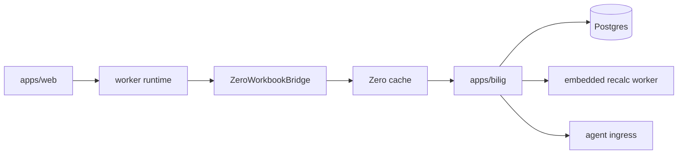

# Architecture

## Current architecture

The active production architecture is:

## Active seams

- `@bilig/core`
  - workbook state
  - transactions
  - metadata
  - formula/runtime execution
  - canonical `@bilig/workbook` run adapter for materializing generic commands and proving generic checks
  - snapshot import/export
- `@bilig/workbook`
  - agent-first public workbook model API
  - phase-scoped find/check/action contexts
  - frozen workbook refs with non-enumerable ergonomic helpers
  - frozen public helper namespaces for find/check/formula construction
  - JSON-safe ref data plus hydration helpers for agent/runtime transport
  - own-data-only ref discovery and hydration, with accessors ignored instead
    of invoked during planning and transport
  - data-only ref array traversal and known-field ref cloning without
    enumerable-property spread
  - frozen plan refs containers with `refsUsed` verification
  - frozen JSON-safe descriptions for model/ref/plan/result inspection
  - transported plan data through `toPlanData`, `hydratePlanData`, and
    `verifyPlanData`
  - structured `checkPlanData` diagnostics for JSON handoff payloads
  - own-enumerable-data transported plan arrays before hydration or execution
  - transported plan execution through `runWorkbookPlan` without requiring the
    consumer's private `refs` object shape
  - generic selector validation before runtime handoff, including canonical table-header selectors and row predicate value contracts
  - JSON-safe action input planning and verification
  - own-data-only action input and input-metadata normalization, with accessors
    rejected instead of invoked before model code runs
  - action-object metadata, plain input descriptions, and `checkInput` payload
    checks for agent manifests
  - frozen model inspection and action-plan result wrappers
  - machine-readable readback checks for runtime proof
  - readback proof attached to passed value/formula checks
  - exact readback target validation, including duplicate-target rejection
  - frozen validator and readback-proof verdicts for stable agent handoff
  - frozen run results for inspect-once apply/readback/check proof
  - stable run error code union for predictable agent branching
  - null-prototype model action manifests with own-action-only planning
  - transport-neutral run adapters for preview/apply/readback/check proof
  - strict run mode for one-flag agent-safe apply, plan, concrete-op, and
    resolved-ref proof
  - runtime adapter capability checks before mutation handoff
  - bundle-scoped receipt changed-range validation for command proof
  - duplicate command-id rejection for inspectable command bundles
  - frozen command/feature/result/receipt validator verdicts for generic
    runtime handoff
  - structured `checkRuntimeRequirements` diagnostics for transported adapter
    handoff payloads
  - own-enumerable-data runtime requirement arrays and nested ref arrays before
    adapter validation
  - frozen normalized runtime requirement handoffs before agents trust adapter
    checklists
  - feature command request validation before runtime-owned workbook extension
    dispatch
  - feature command receipt validation before agents trust runtime extension
    evidence
  - accepted command results that reject settled proof fields before runtime
    receipts exist
  - semantic receipt-status validation and receipt-derived command result
    summaries
  - canonical feature receipt op matching that ignores property order while
    rejecting invalid or accessor-backed op arrays before proof comparison
  - feature plugin manifest validation before consumer-owned extension
    registration
  - frozen feature vocabulary lists for agent tool manifests and UI handoff
  - check-only runtime execution that skips mutation when no apply capability
    is required
  - apply summaries that expose preview ops, applied ops, preview/apply match,
    and unverified apply facts
  - command-level apply receipts that bind each planned high-level command to
    the materialized preview and applied operations returned by a runtime
  - strict command proof that rejects empty materialized ops or missing
    resolved-ref evidence for ref-targeting commands
  - failed run ledgers that preserve changed summaries and undo metadata after
    runtime apply, but keep `changed: []` when failed apply proof reports no
    applied ops and no undo
  - generic check verifier handoff for runtime-owned invariants
  - own-field-only runtime proof validation for adapter apply results, undo
    refs, runtime errors, and check verifier output
  - own-enumerable-data runtime preview ops, applied ops, undo ops, runtime
    errors, and verifier proof before cloning or preview/apply comparison
  - own-field-only feature receipt changed-range validation
  - own-enumerable-data feature manifest arrays, receipt ops, undo ops, ranges,
    and errors before freezing or runtime proof comparison
  - transport-neutral workbook ops and txns with own-field-only public guards
  - accessor-free low-level op fields, nested fields, and op arrays before
    runtime guard acceptance
- `packages/zero-sync`
  - Zero schema
  - query registry
  - mutator definitions
  - generic `workbook.applyWorkbookPlanData` mutation schema for transported
    `@bilig/workbook` model plans
  - runtime config
- `apps/web`
  - worker-first shell
  - Zero bridge
  - grid integration
- `apps/bilig`
  - session/auth boot
  - Zero query/mutate endpoints
  - authoritative write path
  - recalc/materialization
  - agent APIs
  - authoritative agent apply validates the existing app command bundle through
    the generic `@bilig/workbook` command-bundle handoff before mutation
  - agent execution records require generic `WorkbookCommandResult` proof for
    the exact accepted bundle and applied revision before persistence
  - authoritative transported `WorkbookPlanData` apply runs through the
    `@bilig/core` strict workbook adapter, persists the original generic plan
    plus concrete applied ops, and rolls back runtime ops when post-apply proof
    fails

## Removed topology

The following are not current architecture anymore:

- standalone `apps/local-server`
- standalone `apps/sync-server`
- separate CRDT-first browser sync authority
- Redis on the correctness path

## Product rules

- authoritative workbook ordering happens on the server
- Zero syncs relational source/eval state rather than whole-workbook snapshots
- the UI consumes viewport patches, not raw engine internals
- snapshots remain warm-start artifacts, not the hot synced model
- `@bilig/workbook` models stay consumer-defined and domain-neutral
- `@bilig/workbook` plans are inspectable data before runtime execution
- `@bilig/workbook` runtime proof binds both the whole plan and each planned
  command to the materialized workbook ops before an agent trusts apply results
- `@bilig/workbook` command bundles are revision-bound, idempotent, ordered,
  range-scoped, explicitly destructive, and require declared touched ranges when
  a scope cell limit is present before runtime execution
- app-owned agent command bundles must pass through the generic
  `@bilig/workbook` command-bundle validator before preview/apply execution
- app-owned agent execution records must carry the validated generic command
  result proof after authoritative apply
- `@bilig/workbook` results must expose proof for runtime apply and passed
  checks, preserve changed/undo evidence after post-apply failures, or preserve
  the unverified state instead of hiding it behind a done status
- transported model plans are persisted as generic plan data plus materialized
  applied ops; replay uses the applied ops, while agents inspect the plan/result
  proof instead of a human spreadsheet UI state

## Recommended next focus

1. keep reducing projection churn and render write amplification
2. keep tightening CI, rollout, and rebuild validation around the monolith path
3. keep closing the remaining non-production canonical formula rows
