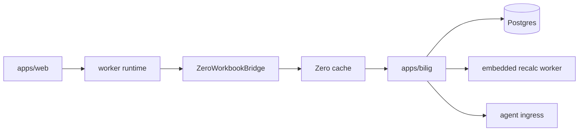

# Architecture

## Current architecture

The active production architecture is:

## Active seams

- `@bilig/core`
  - workbook state
  - transactions
  - metadata
  - formula/runtime execution
  - canonical `@bilig/workbook` run adapter for materializing generic commands and proving generic checks
  - snapshot import/export
- `@bilig/workbook`
  - agent-first public workbook model API
  - phase-scoped find/check/action contexts
  - frozen workbook refs with non-enumerable ergonomic helpers
  - JSON-safe ref data plus hydration helpers for agent/runtime transport
  - frozen plan refs containers with `refsUsed` verification
  - transported plan data through `toPlanData`, `hydratePlanData`, and
    `verifyPlanData`
  - structured `checkPlanData` diagnostics for JSON handoff payloads
  - transported plan execution through `runWorkbookPlan` without requiring the
    consumer's private `refs` object shape
  - generic selector validation before runtime handoff, including canonical table-header selectors and row predicate value contracts
  - JSON-safe action input planning and verification
  - action-object metadata, plain input descriptions, and `checkInput` payload
    checks for agent manifests
  - machine-readable readback checks for runtime proof
  - readback proof attached to passed value/formula checks
  - stable run error code union for predictable agent branching
  - transport-neutral run adapters for preview/apply/readback/check proof
  - runtime adapter capability checks before mutation handoff
  - structured `checkRuntimeRequirements` diagnostics for transported adapter
    handoff payloads
  - feature command request validation before runtime-owned workbook extension
    dispatch
  - feature command receipt validation before agents trust runtime extension
    evidence
  - feature plugin manifest validation before consumer-owned extension
    registration
  - frozen feature vocabulary lists for agent tool manifests and UI handoff
  - check-only runtime execution that skips mutation when no apply capability
    is required
  - apply summaries that expose preview ops, applied ops, preview/apply match,
    and unverified apply facts
  - failed run ledgers that preserve changed summaries and undo metadata after
    runtime apply, but keep `changed: []` when failed apply proof reports no
    applied ops and no undo
  - generic check verifier handoff for runtime-owned invariants
  - transport-neutral workbook ops and txns
- `packages/zero-sync`
  - Zero schema
  - query registry
  - mutator definitions
  - runtime config
- `apps/web`
  - worker-first shell
  - Zero bridge
  - grid integration
- `apps/bilig`
  - session/auth boot
  - Zero query/mutate endpoints
  - authoritative write path
  - recalc/materialization
  - agent APIs

## Removed topology

The following are not current architecture anymore:

- standalone `apps/local-server`
- standalone `apps/sync-server`
- separate CRDT-first browser sync authority
- Redis on the correctness path

## Product rules

- authoritative workbook ordering happens on the server
- Zero syncs relational source/eval state rather than whole-workbook snapshots
- the UI consumes viewport patches, not raw engine internals
- snapshots remain warm-start artifacts, not the hot synced model
- `@bilig/workbook` models stay consumer-defined and domain-neutral
- `@bilig/workbook` plans are inspectable data before runtime execution
- `@bilig/workbook` results must expose proof for runtime apply and passed
  checks, preserve changed/undo evidence after post-apply failures, or preserve
  the unverified state instead of hiding it behind a done status

## Recommended next focus

1. keep reducing projection churn and render write amplification
2. keep tightening CI, rollout, and rebuild validation around the monolith path
3. keep closing the remaining non-production canonical formula rows
