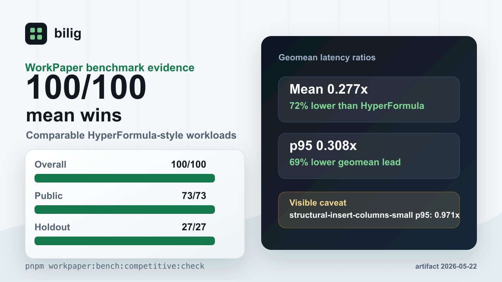

# What The WorkPaper Benchmark Proves

Status: public benchmark explainer for `@bilig/headless`

This page is the short, shareable version of the WorkPaper benchmark claim. It
turns the checked-in artifact into a plain-English evaluation guide without
inflating what the benchmark can prove.



## The Claim

The current checked-in WorkPaper-vs-HyperFormula artifact records WorkPaper
`100/100` mean-latency wins on scorecard-eligible comparable workloads. This is
a scoped headless-runtime lead with checked p95 evidence, not a blanket
fastest-engine claim:

| Lane    | Comparable Workloads | WorkPaper Mean Wins | HyperFormula Mean Wins |
| ------- | -------------------: | ------------------: | ---------------------: |
| Overall |                `100` |               `100` |                    `0` |
| Public  |                 `73` |                `73` |                    `0` |
| Holdout |                 `27` |                `27` |                    `0` |

The artifact is
[`packages/benchmarks/baselines/workpaper-vs-hyperformula.json`](../packages/benchmarks/baselines/workpaper-vs-hyperformula.json),
generated at `2026-05-22T21:48:09.402Z`.

The overall directional mean-ratio geomean is `0.2774840178659166`, and the
overall directional p95-ratio geomean is `0.3079704926176666`. Ratios below
`1.0` mean WorkPaper is faster on that metric.

The headless leadership scorecard records `100/100` workloads winning both
mean and p95 against HyperFormula.

## What It Proves

It proves that the checked-in WorkPaper runtime is faster on mean latency for
most rows in the current scorecard of directly comparable headless
spreadsheet-engine workloads, with an aggregate mean and p95 geomean lead.

The covered families include workbook build and rebuild paths, runtime restore
from snapshot, sheet lifecycle, named expressions, dirty execution, batch edits,
structural row and column edits, range reads, aggregations, conditional
aggregation, and lookup workloads.

It also proves that the benchmark claim is auditable from the repository. The
expected scorecard shape is checked by:

```bash
pnpm workpaper:bench:competitive:check
```

## What It Does Not Prove

It does not prove that bilig is a complete Excel clone.

It does not prove full formula parity with Excel, Google Sheets, or
HyperFormula.

It does not prove future p95 rows will stay faster after new workloads are
added. The current headless leadership scorecard records `100/100` workloads
winning both mean and p95. The current worst p95 row is
`structural-insert-columns-small`, where the current WorkPaper-to-HyperFormula
p95 ratio is `0.9711365981849868`. The honest claim is the checked headless
runtime leads this comparable suite today, not that every future workbook shape
is covered.

It does not prove that browser-grid rendering, import/export, collaboration, or
every user workload is faster. This benchmark is about the headless WorkPaper
runtime path.

It does not prove future results. If the artifact is regenerated and the
scorecard changes, the public claim must change with it.

## Why Mean And p95 Both Matter

Mean latency answers: "what is the normal cost of this workload?"

p95 latency answers: "what happens near the slow end of this workload's sample
set?"

A workload can win on mean while losing on p95 when a small number of slower
samples move the tail. That is why bilig keeps both the headline mean claim and
the worst p95 row visible even when there are no current comparable p95 holdouts.

## How To Evaluate It

For the benchmark evidence, start with:

- [`docs/headless-workpaper-benchmark-evidence.md`](headless-workpaper-benchmark-evidence.md)
- [`packages/benchmarks/baselines/workpaper-vs-hyperformula.json`](../packages/benchmarks/baselines/workpaper-vs-hyperformula.json)
- [`docs/assets/workpaper-benchmark-card.png`](assets/workpaper-benchmark-card.png)
- [benchmark critique discussion](https://github.com/proompteng/bilig/discussions/340)

For the API surface, run the published package or maintained example:

```bash
pnpm add @bilig/headless
```

```bash
pnpm --dir examples/headless-workpaper install --ignore-workspace
pnpm --dir examples/headless-workpaper run start
```

## Shareable Copy

Short:

> bilig's WorkPaper benchmark currently records `100/100` mean wins and
> `100/100` mean+p95 wins against comparable HyperFormula-style headless
> workloads, with the worst p95 row documented instead of hidden.

Reply-sized:

> the useful part is the audit trail: a checked-in benchmark artifact, a verify
> command, and explicit p95 evidence. the claim is `100/100` mean wins and
> `100/100` mean+p95 wins for the current comparable headless WorkPaper
> workloads, not "we are faster at everything."
